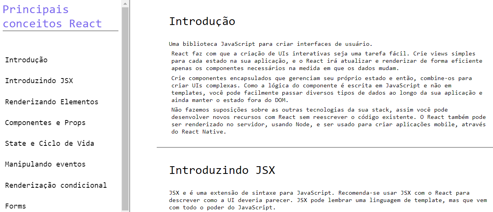

# technical-documentation-page

Página Web de documentação técnica :bookmark_tabs:

Projeto desenvolvido por meio de instruções do curso <strong>Responsive Web Design</strong> disponibilizado pela plataforma <strong><a href="https://www.freecodecamp.org/">freeCodeCamp</a></strong>.

Tecnologias usadas:
* HTML
* CSS

## Preview page
</img> 
